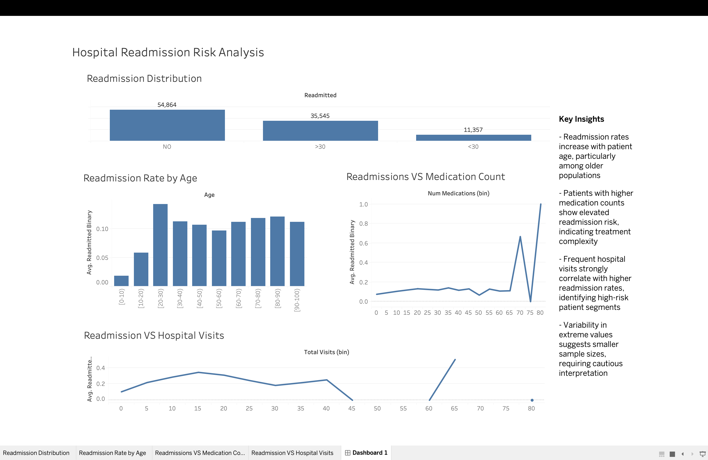

# healthcare-readmission-analysis
**📌 Objective**

Analyzing hospital readmissions to identify high risk patients and improve outcomes.

**Tools Used**

SQL
Python (Pandas, Scikit-learn),
Tableau,
Google Colab

**📁 Project Structure**

- data/ → raw dataset
- notebooks/ → analysis code
- dashboard/ → visualizations

**Key Insights**

- Readmission rates increase with patient age, particularly among older populations
- Higher medication counts are associated with increased readmission risk, suggesting greater treatment complexity
- Patients with frequent hospital visits demonstrate significantly higher readmission rates, indicating high-risk segments
- Variability in extreme values reflects smaller sample sizes, requiring cautious interpretation

**Recommendations**

## 📊 Interactive Dashboard
[View Tableau Dashboard] https://public.tableau.com/app/profile/merida.toala/viz/HospitalReadmissionRiskAnalysis_17752591205010/Dashboard1?publish=yes

## Dashboard Preview

